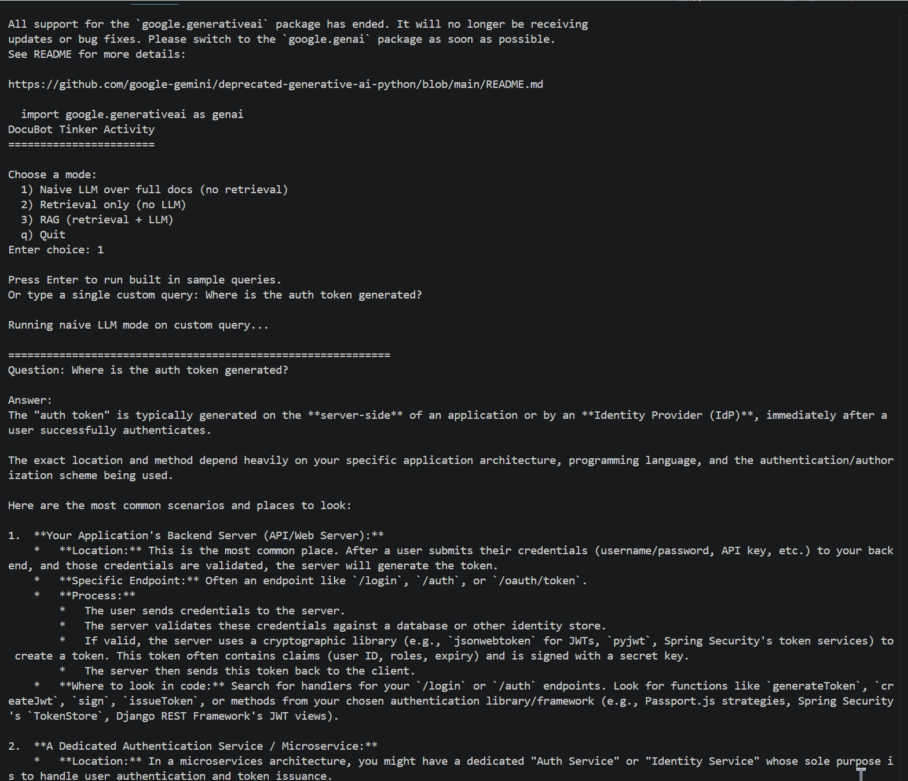
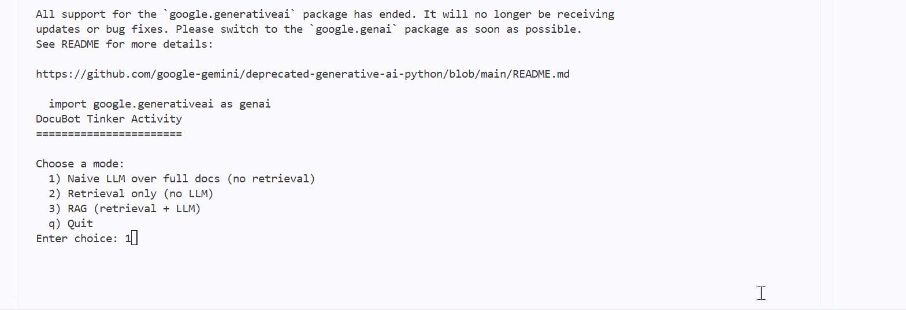
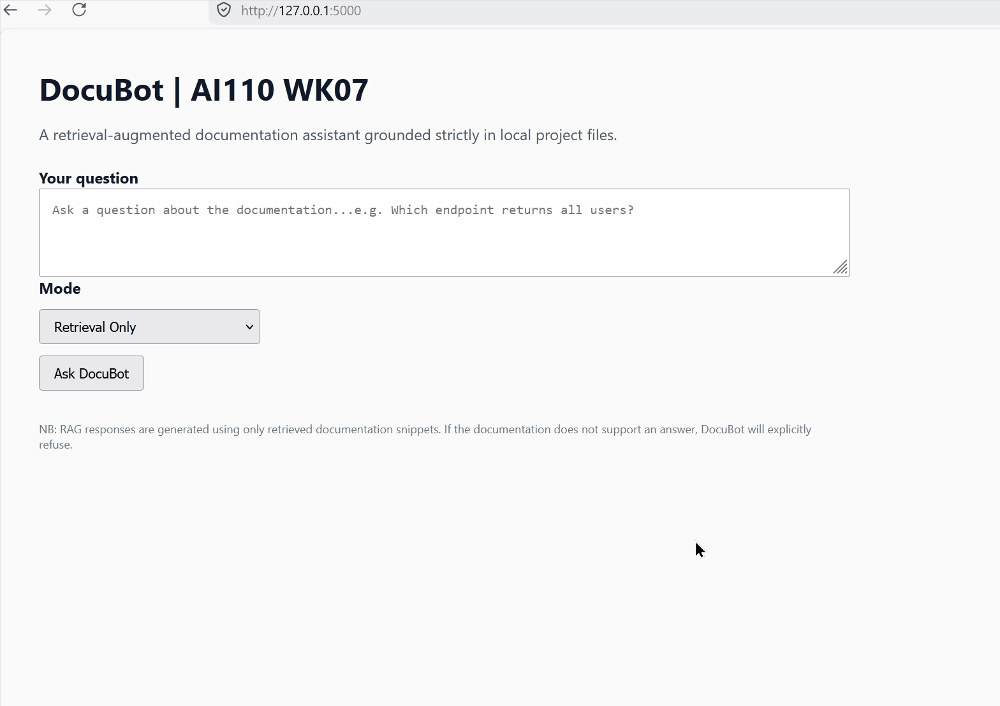

# DocuBot
# 👉 [ReadMe](README.md) | [Model Card](model_card.md) |

DocuBot is a small documentation assistant that helps answer developer questions about a codebase.  
It can operate in three different modes:

1. **Naive LLM mode**  
   Sends the entire documentation corpus to a Gemini model and asks it to answer the question.

2. **Retrieval only mode**  
   Uses a simple indexing and scoring system to retrieve relevant snippets without calling an LLM.

3. **RAG mode (Retrieval Augmented Generation)**  
   Retrieves relevant snippets, then asks Gemini to answer using only those snippets.

The docs folder contains realistic developer documents (API reference, authentication notes, database notes), but these files are **just text**. They support retrieval experiments and do not require students to set up any backend systems.

---
## What’s happening conceptually in CLI
- The model sees everything
- It is allowed to guess
- It answers even when the docs don’t clearly contain the answer
- ✅ This is intentionally unsafe
- ✅ The CodePath assignment expects this behavior
- ✅ This demonstrates hallucination risk

✅ CLI — Retrieval & RAG
In CLI Mode 2 and 3:
- Retrieval only → snippets must match query
- RAG → snippets MUST exist, or it refuses
Therefore, if the docs don’t actually contain strong keyword matches, we get: I do not know based on these docs.

---
✅ Web UI:
Does NOT run naive mode
Only exposes:
- Retrieval only
- RAG

So when you ask a question that is/are:

- Is vague
- Uses synonyms not in docs
- Isn’t well supported by keywords

The system correctly refuses with:
- "I do not know"
- "I do not know based on the provided documentation."

- ✅ These behaviours are not a bug
- ✅ That is our guardrail working

### NB: This distinctions are actually important when you notice how naive mode answers confidently, while retrieval and RAG refuse when evidence is missing. This contrast demonstrates why retrieval grounding is necessary. Which is what this Tinker activity is trying to teach.
---

## Setup

### 1. Install Python dependencies

    pip install -r requirements.txt

### 2. Configure environment variables

Copy the example file:

    cp .env.example .env

Then edit `.env` to include your Gemini API key:

    GEMINI_API_KEY=your_api_key_here

If you do not set a Gemini key, you can still run retrieval only mode.

---

## Running DocuBot

Start the program:

    python main.py

Choose a mode:

- **1**: Naive LLM (Gemini reads the full docs)  
- **2**: Retrieval only (no LLM)  
- **3**: RAG (retrieval + Gemini)

You can use built in sample queries or type your own.

---

## Running Retrieval Evaluation (optional)

    python evaluation.py

This prints simple retrieval hit rates for sample queries.

---

## Modifying the Project

You will primarily work in:

- `docubot.py`  
  Implement or improve the retrieval index, scoring, and snippet selection.

- `llm_client.py`  
  Adjust the prompts and behavior of LLM responses.

- `dataset.py`  
  Add or change sample queries for testing.

---

## Requirements

- Python 3.9+
- A Gemini API key for LLM features (only needed for modes 1 and 3)
- No database, no server setup, no external services besides LLM calls
